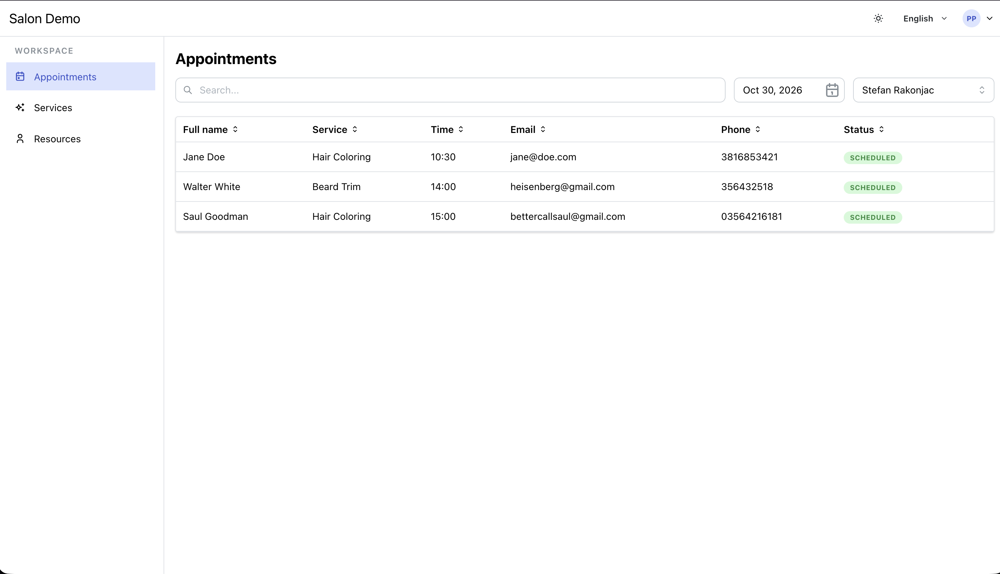
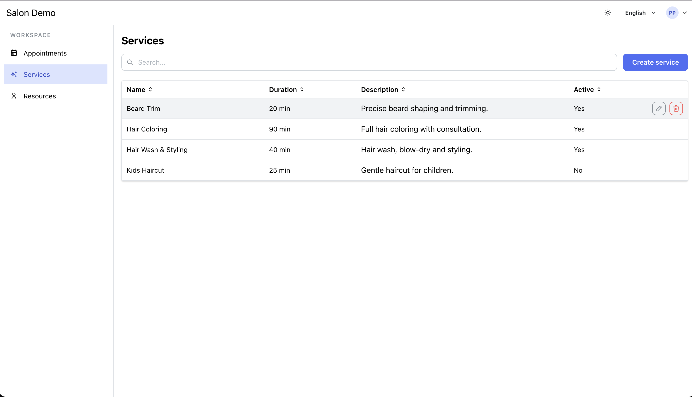
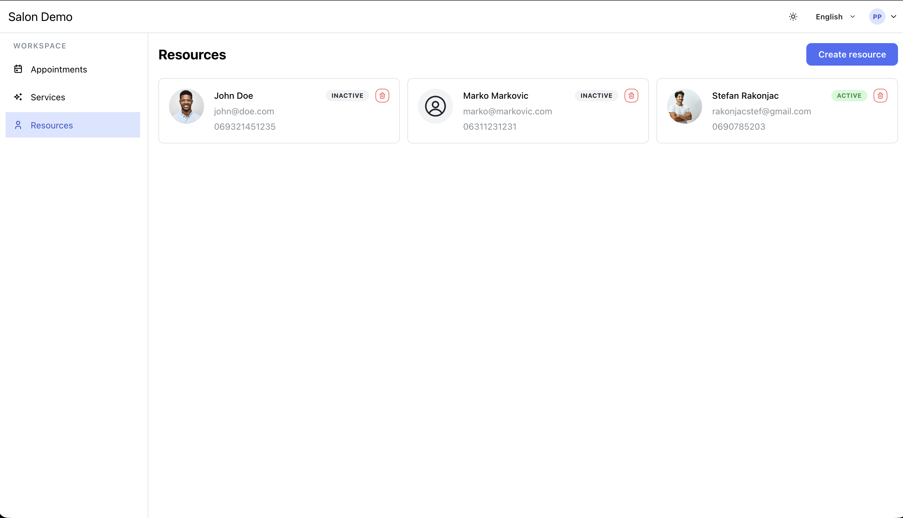
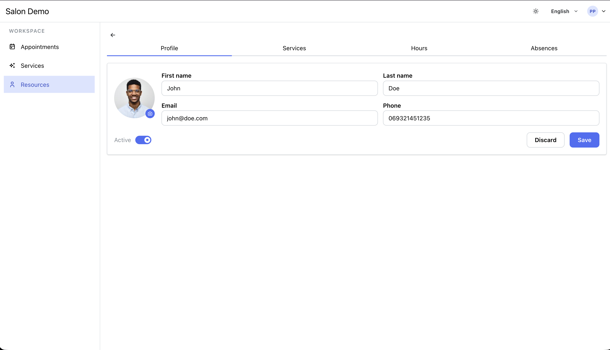

# Terminko Manager

Web dashboard for **Terminko**, a multi-tenant appointment scheduling platform
for small businesses (salons, barbers, dentists). Owners and staff use it to
manage appointments, resources, services, working hours, and guests.

**Live demo: [terminko-manager.vercel.app](https://terminko-manager.vercel.app/)**

Demo login (Owner): `owner@demo.rs` / `Owner01`

> Backed by a Render-hosted API. The API sleeps after 15 minutes of
> inactivity, so the first login after a pause takes 30 to 60 seconds while
> the backend wakes up.

> **Part of the Terminko project:**
> - 🖥️ [terminko-server](https://github.com/xarambash/terminko-server): REST API
> - 🌐 **terminko-manager**: Web dashboard (this repo)
> - 📱 [terminko-mobile](https://github.com/xarambash/terminko-mobile): Mobile app (guests)

---

## Screenshots

### Appointments



### Services



### Resources



### Resource profile



---

## Features

- Appointments overview with resource and date filters, responsive between table (desktop) and timeline (mobile)
- Resource management with CRUD, profile photo upload, and active toggle
- Service management with duration and description
- Per-resource scheduling: working hours (multiple intervals per day), free days (date ranges), and service assignments with price and duration override
- Role-aware UI: Owners see full tenant data, Staff see only their own resource and appointments
- Bilingual UI (English and Serbian) with i18next
- Light and dark theme toggle
- Design system centralized in `src/theme.ts` with a global `sm` component size and token-based spacing

## Tech stack

| Area           | Choice                                     |
| -------------- | ------------------------------------------ |
| Language       | TypeScript 5 (strict)                      |
| UI             | React 19, Mantine v9, Tabler Icons         |
| Data fetching  | TanStack React Query v5                    |
| Routing        | React Router 7                             |
| HTTP           | axios                                      |
| Forms          | Mantine Form                               |
| Dates          | date-fns, dayjs                            |
| i18n           | i18next, react-i18next                     |
| Build          | Vite 8                                     |
| Hosting        | Vercel                                     |
| Tooling        | ESLint                                     |

## Running locally

```bash
git clone https://github.com/xarambash/terminko-manager.git
cd terminko-manager
cp .env.example .env    # adjust values if needed
npm install
npm run dev
```

The app runs at `http://localhost:5173`. It expects a running
[terminko-server](https://github.com/xarambash/terminko-server) instance
reachable at `VITE_API_URL`.

| Script            | What it does                            |
| ----------------- | --------------------------------------- |
| `npm run dev`     | Start the Vite dev server               |
| `npm run build`   | Type-check and build for production     |
| `npm run lint`    | Run ESLint                              |
| `npm run preview` | Serve the production build              |

### Environment variables

| Variable            | Purpose                                            |
| ------------------- | -------------------------------------------------- |
| `VITE_API_URL`      | Base URL of the terminko-server API                |
| `VITE_TENANT_SLUG`  | Tenant slug the dashboard should log into          |

## Project structure

```
src/
├── api/          # axios calls, one file per domain
├── hooks/        # TanStack Query wrappers
├── pages/        # Route-level components
├── components/   # Shared UI, modals, and layout
├── contexts/     # Auth context (JWT, localStorage)
├── services/     # Cross-cutting client-side logic
├── lib/          # Small utilities
├── locales/      # i18next translation files (en, sr)
├── types/        # Shared TypeScript types
└── theme.ts      # Mantine theme, size, and spacing tokens
```

## Notes

This is a portfolio project. The backend runs on a free Render instance and
the database holds demo data only. Real user data is not stored.

Some management flows (guest ban, service edit from the floating action bar)
are wired to the UI but not yet backed by an API endpoint.

## What I'd do next

- Unit tests (Vitest + React Testing Library) for critical flows: login, appointment cancel, working-hours form
- Wire up the remaining action-bar operations to real endpoints
- Owner analytics dashboard (bookings per resource, revenue per service)
- Optimistic updates on cancel and delete
- GitHub Actions CI running lint, type-check, and build on every push

## Author

Stefan Rakonjac, [@xarambash](https://github.com/xarambash)
